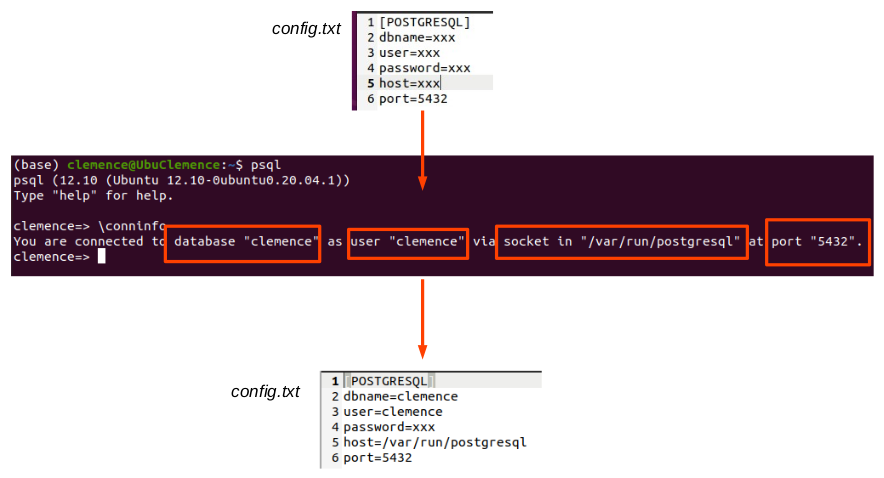
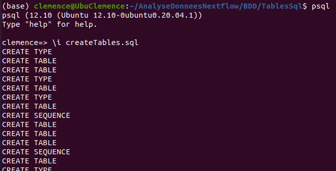
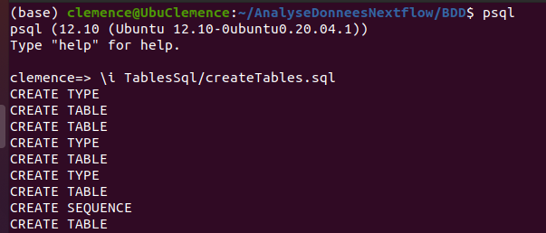
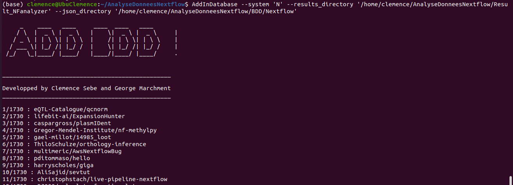

# AddInDatabase

In this directory is presented the tool __AddInDatabase__, which allows to fill a database implemented with Postgresql.

To launch this tool, you need to have the folder containing the results of the __Nextflow analyser__ and a folder with the __global information__ (author and information about the workflow from github)

## Install and Run

To install and run this tool, you first need to be __in this directory__.

### <ins>Postgrsql Connection file configuration</ins> :

This file is located in the [resources](/BDD/resources/) folder. How find the information to complete the documentation :

* In a terminal open a postgresql session: ```psql```
* Then type the command: ```\conninfo```
* To finish, put your parameters in the config file and add your password.



### <ins>To install</ins> :

```
sudo python3 setup.py install
```

### <ins>Before running </ins> :

In the postgresql session launch the [script](/BDD/TablesSql/createTables.sql) to create the tables :

Command : 
```\i address_to_the_script_if_not_in_the_same_directory/createTables.sql ```





### <ins>To run</ins> :

* The option *--system* : 'N' (Nextflow) 

```
AddInDatabase --system 'N' --results_directory 'address/to_folder/to_result' --json_directory 'address/to_folder/to_json_information'
```



### Requirements 
Your software environment needs the following Python packages : 
* configparser
* argparse
* psycopg
* pathlib
* datetime
* glob
* json
* os