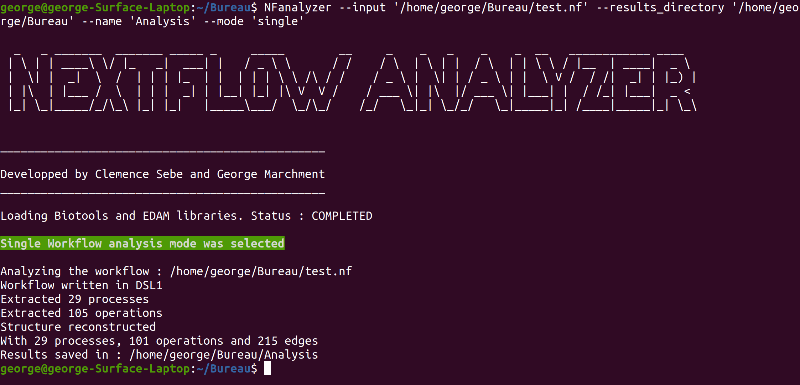
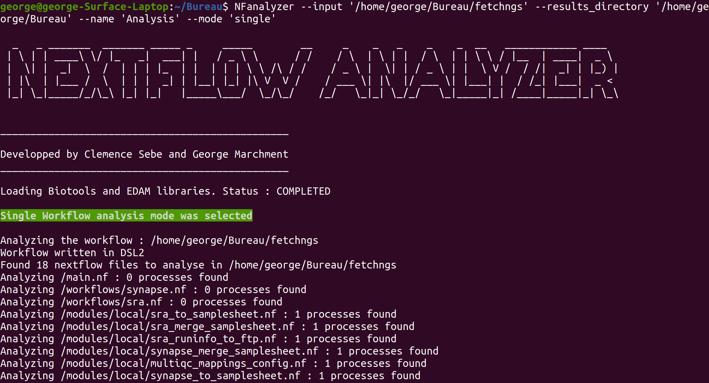
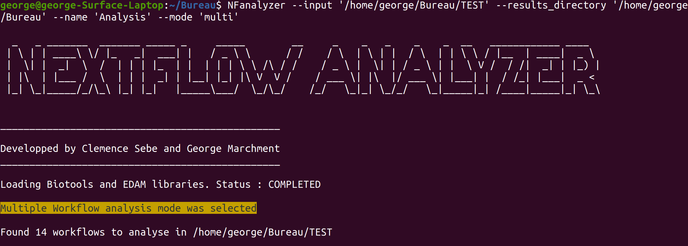

# AnalyseDonneesNextflow

## To install :
```
sudo python3 setup.py install
```

## To run :

See [here](Docs/Examples%20Nextflow%20Analyzer.pdf) for a more explicit explanation on how to run the analyzer

* Single mode (DSL1 workflow) : 
```
NFanalyzer 'address/to_folder/to_workflow' 'address/to_save' --name 'New_Analysis' --mode 'single'
```


* Single mode (DSL1 workflow) : 
```
NFanalyzer 'address/to_folder/to_workflow' 'address/to_save' --name 'New_Analysis' --mode 'single'
```


* Multi mode :
```
NFanalyzer 'address/to_folder/to_workflows' 'address/to_save' --name 'New_Analysis' --mode 'multi'
```

